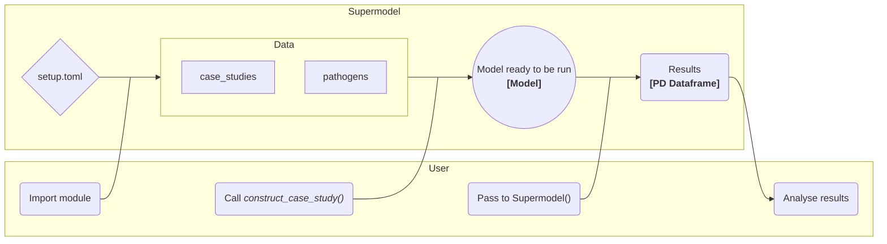

## Requirements

This project was written in python 3.11, and uses [git lfs](https://git-lfs.com/) to store some file types. 

If you have issues with the .xlsx files, check that they have been poulated by lfs by running 

> git lfs pull

## Setup

### Venv

Create a venv in the supplied .venv

> python3 -m venv .venv

### Dependencies
Then move into the venv and install dependencies

> source .venv/bin/activate && 
> pip install -r requirements.txt

### Install the module

From the root directory of the repo:
> pip install .

If you are developing or making changes, install using symlinks to the source files, rather than making copies, so modifications don't require reinstallation:
> pip install -e .

Check all the packages are installed:
> pip list

### *You're ready to go!*

## Structure

The main routines are contained in the `supermodel` module. These are imported into each other along with their corresponding helper functions. 

There are some example scripts contained in the `./scripts/` directory that show some example useage of the supermodel functions classes. By default output (if requested) is directed into the `./output/_new/` directory. 

The environment paramaters for the locations of the `./data/`, `./graphics/` and `./data/` folders are held in setup.toml. This should be placed in this root directory. `./setup.toml.example` is included as an example.

The easiest way to get started is to have a look in the notebooks/ folder, and run one as an example.

## Code flow
Below is a flowchart of the main code flow, this is implemented in the `notebooks/example.ipynb` notebook, with the basic code looking like:

```python
import matplotlib.pyplot as plt
import numpy as np
from supermodel import modeling, config # import the modeling and config modules


model = config.construct_case_study('Swiss Courtroom') # construct the Swiss courtroom case study
results = modeling.Supermodel([(model, 20)]) # run the model 20 times

```




