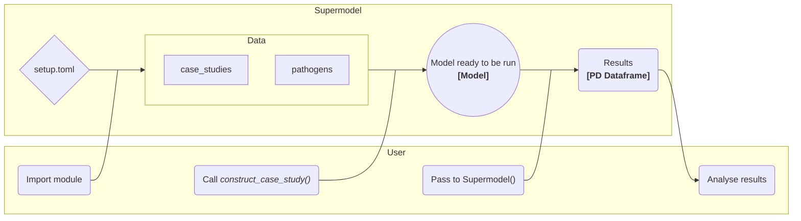

## Requirements

This project was written in python 3.11, and uses [git lfs](https://git-lfs.com/) to store some file types. 

If you have issues with the files specified in `./.gitattributes`, check that they have been poulated by lfs by running 

> git lfs pull

## Setup

### Venv

Create a venv 
> python3 -m venv .venv

### Dependencies
Then move into the venv and install dependencies

> source .venv/bin/activate && 
> pip install -r requirements.txt

### Install the module

From the root directory of the repo:
> pip install .

If you are developing or making changes, install using symlinks to the source files, rather than making copies, so modifications don't require reinstallation:
> pip install -e .

Check all the packages are installed:
> pip list


### *`setup.toml`*

Most importantly this holds the location of the `./data/` folder, containing the model paramaters. This is used on module import to set the location of the data folder.

This file should be placed in this root directory with your specific *absolute* paths. `./setup.toml.example` is included as an example.


### *You're ready to go!*

## Code use
The easiest way to get started is to have a look at the `./example.ipynb` notebook.
### supermodel module

The main routines are contained in the `supermodel` module. These are imported into each other along with their corresponding helper functions:

- `supermodel.modeling` - contains the main `Supermodel` function, which runs the model and returns the results.

- `supermodel.config` - contains the `construct_case_study` function, which constructs a case study and pathogen from their config files.
Below is a flowchart of the main code flow, this is implemented in the `./example.ipynb` notebook, with the basic code looking like:

```python
import matplotlib.pyplot as plt
import numpy as np
from supermodel import modeling, config # import the modeling and config modules


model = config.construct_case_study('Swiss Courtroom') # construct the Swiss courtroom case study
results = modeling.Supermodel([(model, 20)]) # run the model 20 times

```




### `Supermodel()`
Main function for running multiple models in parallel. Runs the model concurrently or sequentially  with the specified number of repeats, returns list of the output Pandas dataframes, for the user to do as they please with.

Paramaters:

    *model*:            list of tuples of model(s) and the number of times to run it (them)
    *repeats*:          number of times to run the model
    *max_threads* :     number of threads to run concurrently
    *to_csv*:           if True, output data to csv
        output_path:    path to output csvs to, defaults to setup.toml value
        other_info:     string to append to output csv name
    *multithread*:      if True, use multithreading, else execute sequentially. Currently havily IO limited and needs to be refactored to use ProcessPoolExecutor, but Model not picklable (yet)
Returns: 

    Pandas dataframe of the output data. Column names are as follows:

        "Susceptible Occupants",
        "Infected Occupants",
        "Infected - Not Quarantined Occupants",
        "Dead Occupants",
        "Quarantined Occupants",
        "Recovered Occupants",
        "Viral Load - Lower", (upper zone)
        "Viral Load - Upper", (lower zone)
        "Time"


## Advanced Use Notes

Modifications to the model can be made at runtime by modifying the `Model` object. For example, to change the time step of the model, you can do the following:

```python
model = config.construct_case_study('Swiss Courtroom') # construct the Swiss courtroom case study
model.time_step_size = 20 # seconds
results = modeling.Supermodel([(model, 20)]) # run the model 20 times
```

Note: The `model` object is an instance of the `supermodel.modeling.Model` class. The attributes can be modified but *they may not behave as you expect*. Safe setter methods have not been implemented for all attributes, so be careful when modifying them, and check the source code if you are unsure.

For example, to modify the pathogen's `phi` (infectiousness) attribute, you have to do the following:

```python
model = config.construct_case_study('Swiss Courtroom') # construct the Swiss courtroom case study
model._cache_phi = new_phi
model.pathogen.phi = new_phi
for occupant in model.occupants:
    occupant.pathogen.phi = new_phi
```
This could be solved by implementing a safe setter for phi:
```python
class Model:
    @property 
    def phi(self):
        return self._cache_phi
    @phi.setter
    def phi(self, new_phi):
        self._cache_phi = new_phi
        self.pathogen.phi = new_phi
        for occupant in self.occupants:
            occupant.pathogen.phi = new_phi
```
Unfortunately, this has been low on my priority list, and has not been implemented yet.
